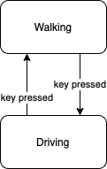

# Simple Open World Sandbox Game 
## What is it?

## The Game 
### Story
### Mechanics

## The Engine
The games is develop using [Godot Engine](https://godotengine.org) on a 3D environment. 

### Players's Finite State Machine
The game consists on multiple game states a.k.a playable context. Those states represents a 3D node for a concrete playable action in the game like driving, walking, flying, swimming, gambling, playing, etc... 

The player's state follows the following FSM:

## TODO

- Add documentation.
- Improve README.
- Add Character assets.
- Add Playable Actor (3rd person) logic.
- Add Vehicles logic.
- Add base Map.
- Add Peds.
  - Add simple Ai.
- Add Guns.
  - Add bullets and fire.